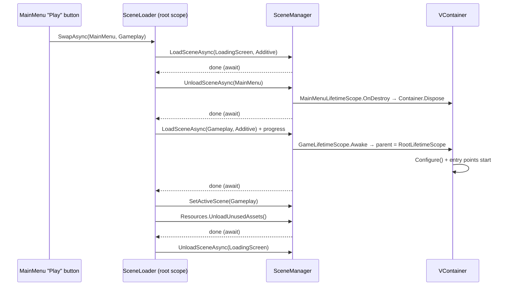

# Additive Scene Loading with UniTask + VContainer

A teaching guide for `dz_troll_platformer`.
Nothing here has been applied to your code — it's a design + reference document.

Your current pieces:

| Piece | File | What it does today |
|---|---|---|
| `SceneId` enum | [SceneId.cs](../Assets/DayZeroGames/Scripts/Core/Contracts/Scene/SceneId.cs) | `Bootstrap, MainMenu, Gameplay, Sandbox` |
| `ISceneLoader` | [ISceneLoader.cs](../Assets/DayZeroGames/Scripts/Core/Contracts/Scene/ISceneLoader.cs) | `Load`, `LoadAsync`, `isLoaded` |
| `SceneLoader` | [SceneLoader.cs](../Assets/DayZeroGames/Scripts/Core/Runtime/Scene/SceneLoader.cs) | `LoadSceneAsync(name)` — **Single** mode |
| `RootLifetimeScope` | [RootLifetimeScope.cs](../Assets/DayZeroGames/Scripts/Core/Runtime/DI/RootLifetimeScope.cs) | DDOL singleton, registers services + `BootstrapEntryPoint` |
| `BootstrapEntryPoint` | [BootstrapEntryPoint.cs](../Assets/DayZeroGames/Scripts/Core/Runtime/Bootstrap/BootstrapEntryPoint.cs) | `IAsyncStartable` → loads `Sandbox` |

---

## 1. The mental model: Single vs Additive

`SceneManager.LoadScene` takes a `LoadSceneMode`:

**`LoadSceneMode.Single`** (what you use now)
- Destroys **every** GameObject in every currently-loaded scene (except `DontDestroyOnLoad` objects).
- The new scene becomes the only scene, and automatically becomes the **active scene**.
- Simple, but everything persistent has to survive via `DontDestroyOnLoad`, which is a flat global bucket with no hierarchy and no clean teardown.

**`LoadSceneMode.Additive`**
- The new scene is added **alongside** whatever is already loaded. Nothing is destroyed.
- The active scene does **not** change automatically — you must call `SceneManager.SetActiveScene` yourself.
- You are now responsible for unloading, via `SceneManager.UnloadSceneAsync`.

The key insight: **additive turns "scene" into a unit of lifetime.** A scene loaded = a subsystem alive. A scene unloaded = that subsystem torn down deterministically, including its `LifetimeScope` container and every `IDisposable` inside it. That's exactly the shape VContainer wants.

### What "unloading a scene" actually frees

`UnloadSceneAsync` destroys the GameObjects/Components in that scene. It does **not** immediately free the *assets* those objects referenced (meshes, textures, audio clips, sprites). Those stay in memory until:

```csharp
await Resources.UnloadUnusedAssets().ToUniTask();
```

That call is a full sweep over the asset database in memory and can take tens of milliseconds to seconds. **Only run it while a loading screen is covering the frame hitch.**

---

## 2. Target scene layout for your project

```
┌─────────────────────────────────────────────────────────┐
│  Bootstrap  (loaded once, NEVER unloaded)               │
│    • RootLifetimeScope  (ISignalBus, ISceneLoader,      │
│      IInputReader, IAudioLibrary, IAudioService)        │
│    • AudioListener, EventSystem, persistent Camera      │
└─────────────────────────────────────────────────────────┘
              +  exactly one of:
┌──────────────────────────┐   ┌──────────────────────────┐
│  MainMenu (additive)     │   │  Gameplay (additive)     │
│   MainMenuLifetimeScope  │ ⇄ │   GameLifetimeScope      │
└──────────────────────────┘   │   + LevelLifetimeScope   │
                               │     (child, per-level)   │
                               └──────────────────────────┘
              +  optionally, on top:
┌─────────────────────────────────────────────────────────┐
│  LoadingScreen (additive, loaded during transitions)    │
└─────────────────────────────────────────────────────────┘
```

Two consequences worth internalising:

1. **`Bootstrap` is now permanent**, so `DontDestroyOnLoad(gameObject)` in `RootLifetimeScope.Awake` becomes *optional*. Keeping it is harmless and protects you if someone ever does a Single-mode load. Keeping the `_instance` guard is still worth it for the "play from Gameplay scene in the editor" case (see §11).

2. **Bootstrap must not be unloaded.** Unity throws if you try to unload the last remaining scene, and unloading the scene holding your root container would kill every registered singleton.

---

## 3. The UniTask API surface you actually need

All of these live in `Cysharp.Threading.Tasks`. Signatures below are copied from the version in your `Library/PackageCache/com.cysharp.unitask@360e370345b9`.

### 3.1 Awaiting an `AsyncOperation`

```csharp
public static UniTask ToUniTask(
    this AsyncOperation asyncOperation,
    IProgress<float> progress = null,
    PlayerLoopTiming timing = PlayerLoopTiming.Update,
    CancellationToken cancellationToken = default,
    bool cancelImmediately = false)
```

You can also just `await op;` directly (UniTask ships a `GetAwaiter` for `AsyncOperation`), but `ToUniTask` is what you want because it gives you progress + cancellation.

- `progress` — called every frame at `timing` with `op.progress`.
- `timing` — which point of the Unity player loop your continuation resumes on. `Update` is the sane default. Use `PlayerLoopTiming.LastPostLateUpdate` if you need to run after everything else in the frame.
- `cancellationToken` — see §9. **Read the warning there before you use it.**
- `cancelImmediately` — if `true`, cancellation fires via a token callback instead of being polled once per frame. Slightly faster reaction, allocates a registration. Leave it `false` unless you have a reason.

### 3.2 Progress

```csharp
var progress = Progress.Create<float>(p => _loadingBar.fillAmount = p);
await op.ToUniTask(progress);
```

`Progress.Create<T>` is UniTask's allocation-light `IProgress<T>`. It only fires when the value *changes*, so you won't get redundant callbacks.

### 3.3 The other UniTask primitives you'll reach for

```csharp
await UniTask.Yield();                          // next Update
await UniTask.NextFrame();                      // strictly next frame
await UniTask.Delay(500, DelayType.UnscaledDeltaTime); // survives Time.timeScale = 0
await UniTask.WaitUntil(() => op.progress >= 0.9f);
await UniTask.WhenAll(taskA, taskB);            // parallel loads
await UniTask.SwitchToMainThread();
someTask.Forget();                              // explicit fire-and-forget
```

`UniTaskVoid` is the return type for a truly fire-and-forget async method (`async UniTaskVoid Foo()`), so it can't be awaited and doesn't allocate a state box. Use `async UniTask` for anything you might await.

---

## 4. Designing the `ISceneLoader` contract

Your current interface can't express additive loading. Here's what it needs to grow:

```csharp
using System;
using System.Threading;
using Cysharp.Threading.Tasks;

namespace DZ.Core.Contracts
{
    public interface ISceneLoader
    {
        // Note: rename isLoaded -> IsLoaded for C# conventions.
        bool IsLoaded(SceneId sceneId);

        SceneId ActiveScene { get; }
        bool IsBusy { get; }

        UniTask LoadAsync(
            SceneId sceneId,
            bool setActive = false,
            IProgress<float> progress = null,
            CancellationToken cancellationToken = default);

        UniTask UnloadAsync(
            SceneId sceneId,
            CancellationToken cancellationToken = default);

        /// Load `to`, unload `from`, then release unused assets.
        UniTask SwapAsync(
            SceneId from,
            SceneId to,
            IProgress<float> progress = null,
            CancellationToken cancellationToken = default);
    }
}
```

Design notes:

- **Keep `void Load(SceneId)`** if you still want a hard, synchronous Single-mode load for a "return to Bootstrap / hard reset" path. It's a genuinely different operation, not a convenience overload.
- **`IsBusy` + a reentrancy guard is mandatory.** Two concurrent additive loads will corrupt the VContainer parent stack (§6) and can produce duplicate scenes. Serialise all transitions through one loader.
- `SwapAsync` exists because the ordering of load-vs-unload is a real decision (§7.3) and you don't want every caller re-deciding it.

---

## 5. Reference implementation (annotated)

This is the shape to aim for. Read the comments — they're the actual lesson.

```csharp
using System;
using System.Collections.Generic;
using System.Threading;
using Cysharp.Threading.Tasks;
using DZ.Core.Contracts;
using UnityEngine;
using UnityEngine.SceneManagement;

namespace DZ.Core.Runtime
{
    public sealed class SceneLoader : ISceneLoader
    {
        // Cache enum -> string once. Enum.ToString() does reflection + allocates
        // every call, and you'd be doing it inside transitions.
        private static readonly string[] Names = Enum.GetNames(typeof(SceneId));

        private readonly Dictionary<SceneId, Scene> _tracked = new();
        private bool _busy;

        public SceneId ActiveScene { get; private set; } = SceneId.Bootstrap;
        public bool IsBusy => _busy;

        private static string NameOf(SceneId id) => Names[(int)id];

        public bool IsLoaded(SceneId id)
        {
            // Ask Unity, don't trust the cache — a scene can be unloaded
            // by something other than this loader (editor, Single-mode load).
            var scene = SceneManager.GetSceneByName(NameOf(id));
            return scene.IsValid() && scene.isLoaded;
        }

        // ------------------------------------------------------------------
        // LOAD
        // ------------------------------------------------------------------
        public async UniTask LoadAsync(
            SceneId id,
            bool setActive = false,
            IProgress<float> progress = null,
            CancellationToken ct = default)
        {
            if (IsLoaded(id))
            {
                Debug.LogWarning($"[SceneLoader] {id} already loaded; ignoring.");
                return;
            }

            var op = SceneManager.LoadSceneAsync(NameOf(id), LoadSceneMode.Additive);

            // LoadSceneAsync returns NULL if the scene isn't in Build Settings.
            // Without this guard you get a NullReferenceException on the await
            // and no clue why.
            if (op == null)
                throw new InvalidOperationException(
                    $"[SceneLoader] Scene '{NameOf(id)}' is not in Build Settings.");

            await op.ToUniTask(progress, PlayerLoopTiming.Update, ct);

            // The scene handle is only valid AFTER the load completes.
            var scene = SceneManager.GetSceneByName(NameOf(id));
            _tracked[id] = scene;

            if (setActive)
            {
                SceneManager.SetActiveScene(scene);
                ActiveScene = id;
            }
        }

        // ------------------------------------------------------------------
        // UNLOAD
        // ------------------------------------------------------------------
        public async UniTask UnloadAsync(SceneId id, CancellationToken ct = default)
        {
            if (!IsLoaded(id)) return;

            // Unity refuses to unload the last loaded scene. With Bootstrap
            // always resident this shouldn't happen, but assert anyway.
            if (SceneManager.sceneCount <= 1)
            {
                Debug.LogError("[SceneLoader] Refusing to unload the only loaded scene.");
                return;
            }

            var op = SceneManager.UnloadSceneAsync(NameOf(id));
            if (op == null) return; // scene wasn't loaded after all

            await op.ToUniTask(cancellationToken: ct);
            _tracked.Remove(id);
        }

        // ------------------------------------------------------------------
        // SWAP  (the transition you'll actually call)
        // ------------------------------------------------------------------
        public async UniTask SwapAsync(
            SceneId from,
            SceneId to,
            IProgress<float> progress = null,
            CancellationToken ct = default)
        {
            if (_busy)
            {
                Debug.LogWarning("[SceneLoader] Transition already in flight; ignoring.");
                return;
            }

            _busy = true;
            try
            {
                await UnloadAsync(from, ct);
                await LoadAsync(to, setActive: true, progress, ct);

                // Now that the old scene's objects are gone, its assets are
                // unreferenced and can be released. Expensive — do it behind
                // the loading screen, never during gameplay.
                await Resources.UnloadUnusedAssets().ToUniTask(cancellationToken: ct);
            }
            finally
            {
                _busy = false; // must reset even if the await threw / cancelled
            }
        }
    }
}
```

---

## 6. Wiring it into VContainer — the part that bites people

### 6.1 How a scene's `LifetimeScope` finds its parent

From `LifetimeScope.GetRuntimeParent()` (VContainer 1.18), resolution order is:

1. `parentReference.Object` — a direct inspector reference. Only works for scopes in the *same* scene.
2. `FindParent()` — a virtual method you can override in code.
3. `parentReference.Type` — **the "Parent" type dropdown in the LifetimeScope inspector.** Does a `FindAnyObjectByType` for that type across all loaded scenes. Throws `VContainerParentTypeReferenceNotFound` if not found yet — but VContainer catches that and re-queues the `Awake`, so a race is survivable.
4. `LifetimeScope.EnqueueParent(...)` — a global stack pushed by the loading code.
5. `VContainerSettings.Instance` root scope — the project-settings auto-root.

**For your setup, option 3 is the simplest and most robust.** Because `Bootstrap` stays loaded forever, `RootLifetimeScope` is always findable. So:

> On `MainMenuLifetimeScope` and `GameLifetimeScope`, open the LifetimeScope inspector → **Parent** → set the type to `RootLifetimeScope`.

That's it. No loading-code coupling, works whether the scene was loaded additively at runtime or opened directly in the editor.

### 6.2 The `EnqueueParent` alternative (and its trap)

If you'd rather decide the parent at load time:

```csharp
using (LifetimeScope.EnqueueParent(_rootScope))
{
    await op.ToUniTask(progress, PlayerLoopTiming.Update, ct);
}
// dispose pops the stack
```

The `using` **must** wrap the await, because the child scope's `Awake` runs during scene activation, i.e. inside that await.

The trap: `GlobalOverrideParents` is a **static `Stack<LifetimeScope>`**. If two additive loads overlap, one pops the other's entry and scopes get parented to the wrong container. This is the concrete reason `SwapAsync` needs its `_busy` guard.

### 6.3 What unloading does to the container — the payoff

```
UnloadSceneAsync(Gameplay)
  └─ GameLifetimeScope.OnDestroy()
       └─ DisposeCore()
            └─ Container.Dispose()
                 ├─ every IDisposable registered in that scope disposed
                 ├─ every entry point (ITickable / IAsyncStartable / …) unregistered
                 └─ child scopes (LevelLifetimeScope) disposed first
```

You get deterministic teardown for free. Two caveats:

- **Objects the child container created that live in `DontDestroyOnLoad` are not destroyed by the unload.** They leak across transitions. If a scoped service instantiates a persistent GameObject, that service must implement `IDisposable` and destroy it.
- **Disposing a child never touches the parent.** `ISignalBus`, `IAudioService` etc. registered in `RootLifetimeScope` survive — which is what you want, but it also means **stale subscriptions leak**. Any gameplay object that did `_signalBus.Subscribe<T>(...)` on a root-scoped bus must `Unsubscribe` in `OnDestroy`/`Dispose`, or the bus will hold a delegate pointing at a destroyed object and you'll get `MissingReferenceException` after the next transition. This is the single most common additive-scene bug in a DI project.

### 6.4 Where transitions get triggered from

Registered in `RootLifetimeScope`, `SceneLoader` is a plain C# object owned by the root container — it is **not** a MonoBehaviour and it is **not** in the unloaded scene. That matters: a coroutine driving a transition would die the moment its host scene unloaded. A UniTask driven by the player loop does not. This is a real advantage of UniTask here, not just syntax sugar.

Your `BootstrapEntryPoint` (an `IAsyncStartable`) becomes the app's front door:

```csharp
public async UniTask StartAsync(CancellationToken cancellation = default)
{
    await _sceneLoader.LoadAsync(SceneId.MainMenu, setActive: true,
                                 cancellationToken: cancellation);
}
```

Note VContainer hands you a `CancellationToken` that is cancelled when the scope is disposed — that's the correct token to thread through.

---

## 7. The full transition, step by step

### 7.1 Sequence



### 7.2 Setting the active scene — why it's not cosmetic

The **active scene** determines:
- Where `Instantiate` puts new GameObjects when no parent is given.
- Which scene's lighting settings / skybox / ambient are used.
- Which scene new NavMesh and physics-scene queries default to.

If you load `Gameplay` additively and forget `SetActiveScene`, `Bootstrap` stays active — every runtime-spawned enemy, pickup and VFX ends up parented into `Bootstrap` and **survives the unload of `Gameplay`**. That's a slow, confusing leak. Always `SetActiveScene` on the new gameplay scene.

### 7.3 Unload-then-load vs load-then-unload

| Order | Pro | Con |
|---|---|---|
| **Unload → Load** | Peak memory = max(old, new). Safe on mobile. | There's a window where neither scene exists — you need a loading screen or you show a black/empty frame. |
| **Load → Unload** | Can cross-fade; the old scene stays visible until the new one is ready. | Peak memory = old + new. Two `AudioListener`s and two `EventSystem`s coexist → Unity spams warnings and input goes weird. |

For a 2D platformer, **unload-then-load behind a loading screen** is the right default (that's what the reference implementation does). If you want cross-fade later, move `AudioListener` and `EventSystem` into `Bootstrap` permanently so the scenes never each carry one.

### 7.4 Progress that isn't a lie

`op.progress` for a scene load runs **0 → 0.9** while loading and only hits `1.0` after activation. If you bind a fill bar straight to it, it stops at 90% and then jumps. Normalise it:

```csharp
var progress = Progress.Create<float>(p => _bar.fillAmount = Mathf.Clamp01(p / 0.9f));
```

It's also not linear in time — it reflects bytes/objects, not seconds. If you want a bar that feels smooth, lerp toward the reported value instead of snapping:

```csharp
float shown = 0f, target = 0f;
var progress = Progress.Create<float>(p => target = Mathf.Clamp01(p / 0.9f));

var loadTask = _sceneLoader.LoadAsync(SceneId.Gameplay, true, progress, ct);
while (!loadTask.Status.IsCompleted())
{
    shown = Mathf.MoveTowards(shown, target, Time.unscaledDeltaTime * 0.5f);
    _bar.fillAmount = shown;
    await UniTask.Yield(PlayerLoopTiming.Update, ct);
}
await loadTask; // observe exceptions
```

Use `Time.unscaledDeltaTime` — if gameplay paused with `Time.timeScale = 0`, scaled time is frozen and your bar never moves.

### 7.5 Deferred activation (`allowSceneActivation = false`)

Sometimes you want the scene fully loaded but *not yet swapped in* — e.g. hold on the loading screen until the player presses a key, or until a fade-out finishes.

```csharp
var op = SceneManager.LoadSceneAsync(NameOf(id), LoadSceneMode.Additive);
op.allowSceneActivation = false;

// !! DO NOT await op here. With activation blocked, isDone stays false
// !! forever and ToUniTask() never completes. This is the #1 mistake.
await UniTask.WaitUntil(() => op.progress >= 0.9f, cancellationToken: ct);

// scene is fully loaded, objects not yet awake
await _fader.FadeOutAsync(ct);
await UniTask.WaitUntil(() => Input.anyKeyDown, cancellationToken: ct);

op.allowSceneActivation = true;
await op.ToUniTask(cancellationToken: ct); // now this completes
```

Two extra things about this mode:
- While `allowSceneActivation` is `false` on *any* pending operation, Unity **stalls all other queued `AsyncOperation`s**. Don't leave one hanging.
- The scene's `Awake`/`OnEnable` (and therefore `LifetimeScope.Build()`) run at the moment you set it back to `true`, not before.

---

## 8. Loading multiple scenes in parallel

If `Gameplay` is split into `Gameplay` + `Level_01` + `Environment`, load them together:

```csharp
await UniTask.WhenAll(
    LoadAsync(SceneId.Gameplay,    setActive: false, ct: ct),
    LoadAsync(SceneId.Level_01,    setActive: false, ct: ct),
    LoadAsync(SceneId.Environment, setActive: false, ct: ct));

SceneManager.SetActiveScene(SceneManager.GetSceneByName("Gameplay"));
```

Unity queues these internally rather than truly parallelising I/O, so it's mostly a convenience — but it *is* how you get a single combined completion point. For aggregate progress, sum the individual `op.progress` values and divide by the count.

⚠️ Do **not** combine `UniTask.WhenAll` with `LifetimeScope.EnqueueParent` (§6.2) — the static parent stack is not concurrency-safe. Use inspector-based parenting (§6.1) if you load scenes in parallel.

---

## 9. Cancellation — the rules

**Rule 1: you cannot actually cancel a Unity scene load.**
Cancelling the token stops *your await*; the `AsyncOperation` keeps running to completion in the background and the scene will still appear. Treat the token as "stop waiting", not "abort". If you cancel mid-load, plan to unload the scene once it lands.

**Rule 2: never pass a token owned by the scene you're leaving.**

```csharp
// WRONG — this MonoBehaviour lives in MainMenu, which the swap destroys.
// The token cancels mid-transition and Gameplay ends up half-initialised.
await _sceneLoader.SwapAsync(SceneId.MainMenu, SceneId.Gameplay,
                             cancellationToken: this.GetCancellationTokenOnDestroy());
```

Use a token owned by something that outlives the transition: the root scope's `IAsyncStartable` token, or a `CancellationTokenSource` held by `SceneLoader` itself (tie it to application quit).

**Rule 3: decide how you observe cancellation.**

```csharp
try
{
    await _sceneLoader.SwapAsync(from, to, ct: ct);
}
catch (OperationCanceledException)
{
    // expected on quit / scope dispose — swallow, don't log as an error
}
```

or, allocation-free:

```csharp
var canceled = await task.SuppressCancellationThrow();
if (canceled) return;
```

**Rule 4: fire-and-forget must be explicit.** A UI button handler can't be `async void` safely — exceptions vanish. Use:

```csharp
public void OnPlayClicked() => PlayAsync().Forget();

private async UniTaskVoid PlayAsync()
{
    await _sceneLoader.SwapAsync(SceneId.MainMenu, SceneId.Gameplay);
}
```

`.Forget()` routes unhandled exceptions to `UniTaskScheduler.UnobservedTaskException` (which logs by default) instead of silently eating them.

---

## 10. Gotchas checklist

| # | Gotcha | Fix |
|---|---|---|
| 1 | Two `AudioListener`s / two `EventSystem`s when scenes coexist | Put exactly one of each in `Bootstrap`; remove from `MainMenu`/`Gameplay`. |
| 2 | Runtime-spawned objects survive the unload | `SetActiveScene` on the new scene, or `SceneManager.MoveGameObjectToScene`. |
| 3 | `LoadSceneAsync` returns `null` → NRE on await | Scene missing from Build Settings. Guard + throw a clear message. |
| 4 | Scene loaded twice additively (no error, two copies) | `IsLoaded` guard before every load. |
| 5 | `UnloadSceneAsync` on the last scene | Unity error. Keep `Bootstrap` resident. |
| 6 | Progress bar stuck at 0.9 | Normalise `p / 0.9f`. |
| 7 | `ToUniTask` never completes | You set `allowSceneActivation = false`. Use `WaitUntil(progress >= 0.9f)`. |
| 8 | Huge frame hitch on transition | `Resources.UnloadUnusedAssets()` — only behind a loading screen. |
| 9 | `MissingReferenceException` after a transition | Stale `ISignalBus` subscriptions from the destroyed scene. Unsubscribe in `Dispose`/`OnDestroy`. |
| 10 | Scope parented to the wrong container | Overlapping loads corrupting `EnqueueParent`'s static stack. Serialise with `_busy`. |
| 11 | `SceneId.ToString()` in a hot path | Cache `Enum.GetNames` once (see §5). |
| 12 | Enum renamed, scene file not (or vice versa) | Add an editor validation test asserting every `SceneId` name exists in Build Settings. |
| 13 | Loading bar frozen while paused | Use `Time.unscaledDeltaTime` / `DelayType.UnscaledDeltaTime`. |
| 14 | Pressing Play from `Gameplay.unity` explodes | No `Bootstrap` → no root container. See §11. |
| 15 | Static/singleton state survives the unload | Additive doesn't reset statics. Reset them explicitly, or don't use them. |

---

## 11. Editor quality-of-life: play from any scene

Once loading is additive, opening `Gameplay.unity` and hitting Play means `RootLifetimeScope` doesn't exist, so `GameLifetimeScope` can't find its parent and everything fails. Two ways out:

**A — `playModeStartScene` (cleanest).** An editor script that always starts Play mode from `Bootstrap`, regardless of what's open:

```csharp
#if UNITY_EDITOR
[InitializeOnLoad]
public static class EditorBootstrap
{
    static EditorBootstrap()
    {
        EditorSceneManager.playModeStartScene =
            AssetDatabase.LoadAssetAtPath<SceneAsset>(
                "Assets/DayZeroGames/Scenes/Bootstrap.unity");
    }
}
#endif
```

You'd then want `BootstrapEntryPoint` to look at which scene was open in the editor and jump straight to it, so the workflow stays fast.

**B — self-healing bootstrap.** A `[RuntimeInitializeOnLoadMethod(RuntimeInitializeLoadType.BeforeSceneLoad)]` hook that additively loads `Bootstrap` if it isn't loaded. Slightly more magic, but works in builds too.

Either way, your existing `_instance != null` guard in `RootLifetimeScope.Awake` is what keeps a second `Bootstrap` from ever double-registering.

---

## 12. Verification checklist

Run through these once implemented:

- [ ] Boot → MainMenu → Gameplay → MainMenu → Gameplay, five times. Scene count in the Hierarchy returns to the same number every cycle.
- [ ] After a round-trip, the Profiler's memory snapshot doesn't grow monotonically.
- [ ] `Object.FindObjectsByType<AudioListener>()` returns exactly 1 at all times.
- [ ] Spawn an enemy at runtime; confirm in the Hierarchy it lands under `Gameplay`, not `Bootstrap`.
- [ ] `GameLifetimeScope`'s container is disposed on unload (add a `Debug.Log` in an `IDisposable` service).
- [ ] Signal subscriptions from `Gameplay` are gone after the unload (publish a signal from `MainMenu` and confirm no stale handler fires).
- [ ] Spam the "Play" button during a transition — the `_busy` guard holds and only one transition runs.
- [ ] Quit the app mid-transition — no `OperationCanceledException` spam in the console.
- [ ] Build to target platform: transition times are acceptable and no scene is missing from Build Settings.

---

## Suggested implementation order

1. Extend `ISceneLoader` (§4) and rewrite `SceneLoader` (§5). Compile.
2. Set the **Parent type** on `MainMenuLifetimeScope` and `GameLifetimeScope` to `RootLifetimeScope` in the inspector (§6.1).
3. Move `AudioListener` + `EventSystem` into `Bootstrap`; strip them from the other scenes.
4. Point `BootstrapEntryPoint` at `SceneId.MainMenu` with `setActive: true`.
5. Add a `LoadingScreen` scene + `SceneId` entry, wire it into `SwapAsync`.
6. Add the editor bootstrap helper (§11).
7. Walk the checklist in §12.
